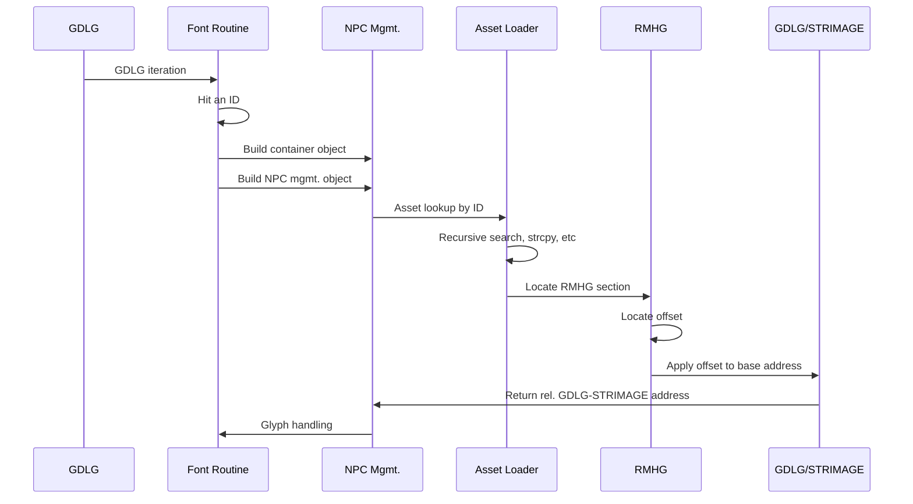

## NPC Names

In simple terms, the `STG` code will load an appropriate script block and iterate over it. During iteration, it will reach an identifier - such as `YNW0010` - and this will kick off the process of constructing both a container and an NPC mgmt. object in memory, then performing a recursive search and locating the relevant NPC asset, and finally locating an offset against an RMHG section that it can apply to a base address to reach the relevant GDLG/STRIMAGE section that contains both the character name and glyph data.

